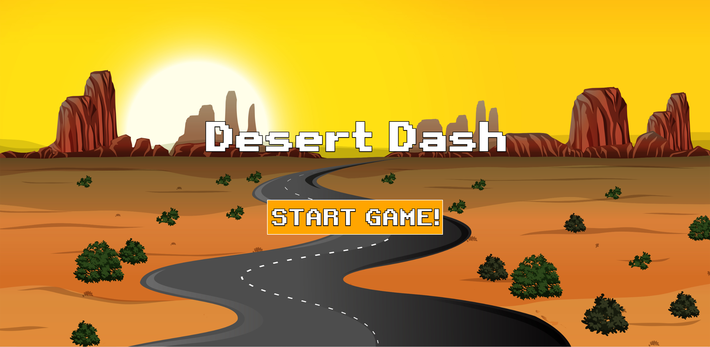
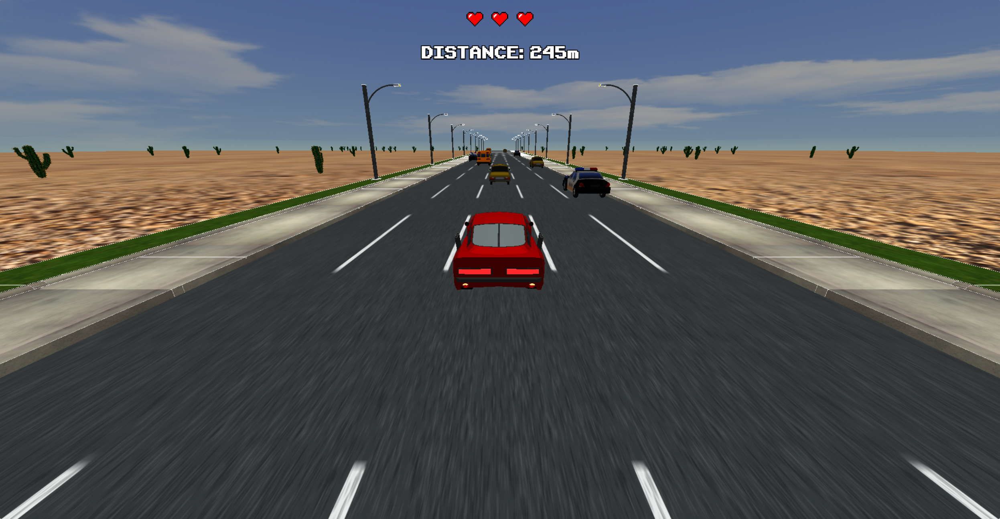

# Desert Dash
 
 

    

    

<h3 align="center">Set in a vast desert landscape, Desert Dash places players behind the wheel of a car on a endless road. The primary objective is to cover the longest distance possible while avoiding obstacles.</h3>

# 🎮 Are you ready to play? [**PLAY NOW**]()

Here are your controls:

- **⬅️**: Move the car to the left
- **➡️**: Move the car to the right

# 📖 [**Report**](https://github.com/SapienzaInteractiveGraphicsCourse/final-project-desert-dash/blob/main/Desert_Dash_report.pdf)

## 📝 Author

- Cacciarini Gianluca (1871982)
